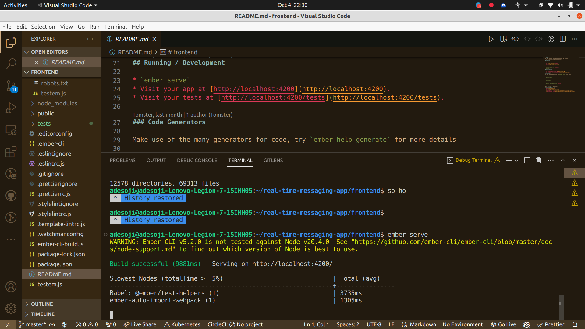

# Real-time Messaging with Ember.js and Go


## 📌 Overview

This project provides a comprehensive solution for real-time messaging using **Ember.js** on the frontend and **Go** (Golang) on the backend. The synergy of Ember.js's reactivity and Go's concurrent capabilities ensures swift messaging experiences, suitable for applications demanding real-time interactions.

### 🚀 What this project achieves:

1. **Real-time Messaging**: Messages are delivered in real-time, ensuring immediate communication between users.
2. **Scalability**: Built on Go's lightweight, concurrent foundation, this messaging system can handle thousands of simultaneous users.
3. **Reactive UI**: With Ember.js, any new message or notification updates the UI in real-time, offering users an engaging experience.
4. **Secure Authentication**: A robust authentication system protects user data and ensures only authenticated users access the platform.
5. **Cross-platform**: Designed to be responsive, the Ember.js frontend can adapt to various devices, from desktops to mobiles.

## 🛠️ Technologies Used

- 
- **Ember.js**: A productive, battle-tested JavaScript framework for building modern web applications.
- 
- **Go (Golang)**: An open-source programming language that makes it easy to build efficient and reliable software.
- 
- **PostgreSQL**: A powerful, open-source object-relational database system.

## 🚢 Getting Started

### Prerequisites

The version and cli running below 



- Node.js and npm (for Ember.js)
- Go (for the backend server)
- PostgreSQL (for the database)

### Setting Up

1. **Backend (Go)**:
    ```bash
    # Navigate to the backend directory
    cd path-to-your-go-backend

    # Set up the environment variables for database
    export DB_HOST=localhost
    export DB_PORT=5432
    export DB_USER=postgres
    export DB_PASSWORD=your_password
    export DB_NAME=your_database_name

    # Run the Go application
    go run *.go
    ```

2. **Frontend (Ember.js)**:
    ```bash
    # Navigate to the frontend directory
    cd path-to-your-ember-frontend

    # Install the dependencies
    npm install

    # Start the Ember.js server
    ember serve
    ```

Visit `http://localhost:4200/` on your browser to view the Ember.js frontend, while the Go backend runs on `http://localhost:8080/`.

## 📘 Documentation

For detailed documentation, including API endpoints, database schemas, and frontend components, refer to [DOCUMENTATION.md](./DOCUMENTATION.md).

## 🙌 Contributing

We welcome contributions! Please read our [CONTRIBUTING.md](./CONTRIBUTING.md) for guidelines on how to proceed.

## 📜 License

This project is licensed under the MIT License. See [LICENSE.md](./LICENSE.md) for more details.

## 🤝 Acknowledgements

- Ember.js community and developers
- The Go team and contributors
- Everyone who provided feedback and contributed to this project

---

Made with ❤️ by [Adesoji Alu or Team Name](https://your-link.com).
